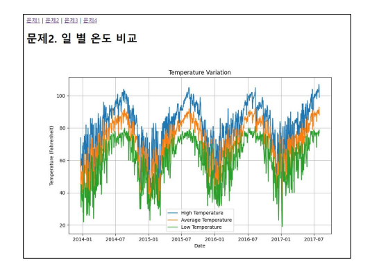
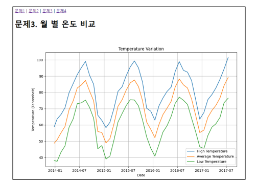
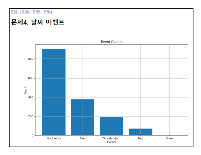

# 금융 프로젝트

### 프로젝트 소개
날씨 데이터를 기반으로 한 시각화 및 인사이트 도출

### 활용 라이브러리 

- Matplotlib
- pandas
- io
- base 64

### 프로젝트 진행

1. 날짜 형식으로 변환하여 일별, 최고, 최저, 평균 온도 도출
   

2. 월별 온도의 비교 plot 사용

3. lambda 와 fillna 를 이용한 결측값 처리

---
---

### 느낀점

1. matplotlib의 적절한 활용을 위해 데이터의 x축과 y축 레이블의 개수를 맞추는 등 전처리의 과정이 중요하다고 느껴졌다.

2. 공식 문서를 찾아보며, 새로운 기능들을 학습하고 사용하는 것을 습관화 해야겠다

3. chat gpt 등을 적절히 활용하여 인사이트를 도출하는 방식 또한 필요한 것으로 보인다. (허나 학습을 위해서 단순 copy paste 는 좋지 않을 것이다.)