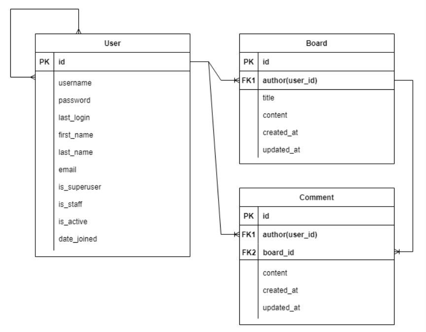

## 회원제 게시판 구현

- 기본적인 게시글 CRUD
- 댓글 기능
- 회원 정보 관리와 회원 가입

- ERD
  

1. Board

---
---

- model : Board, Comment
- 기능
  - 전체 게시글 조회(index)
  - 게시글 생성 페이지 조회 & 게시글 작성 및 저장
  - 단일 게시글 상세 페이지 조회 & 댓글 작성
  - 단일 게시글 수정 페이지 조회 & 게시글 수정 및 저장
  - 댓글 저장 및 삭제

2. accounts

---
---

- model : User
- 기능
  - 로그인 기능
  - 로그아웃 기능
  - 회원 생성 페이지 조회 & 회원 데이터 작성 및 저장(회원가입)
  - 팔로우 데이터 저장 및 팔로우 데이터 삭제

---

### 회고

1. skeleton 코드가 있어서, 규격에 맞춰 작업하는 것이 곤란한 점이 존재했다. 하지만, 협업을 위해서는 미리 만들어진 코드에 빠르게 적응하고 자신의 코드를 녹여내는 능력이 필요할 것으로 보여서, 기존의 코드를 고치는 디버깅에 대한 연습이 필요할 것 같다.

2. db를 옮기는 과정에서 dumpdata 와 loaddata를 진행 하기 위해, 기본적인 명령어를 익혀두고, 관계형 테이블의 경우, 관련된 테이블의 자료까지 함께 dummy data로 추가해주지 않으면 제대로 적용이 안되는 점을 깨달았다.